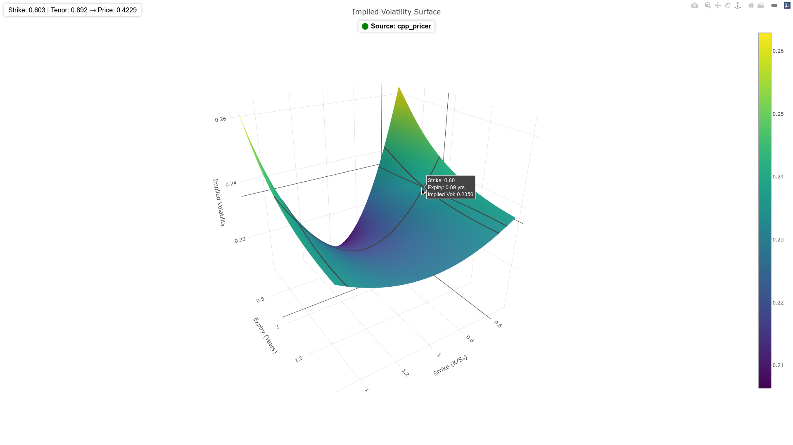

# Options Pricer Demo

A lightweight C++ HTTP server for Black-Scholes option pricing with Prometheus metrics, accompanied by a Python FastAPI frontend for visualizing a volatility surface. Fully containerized for easy setup and teardown using Docker Compose.



## Rationale

- Serve option pricing via a simple HTTP API (C++ server).
- Provide real-time Prometheus metrics including a synthetic demo gauge.
- Python FastAPI frontend connects to the C++ pricer and displays a volatility surface.
- Minimal dependencies, fully containerized, easy to start and stop.
- Recommended to run in a dedicated VM to avoid conflicts with other Docker containers.

## Build & Run

```bash
# Start the demo environment
./scripts/start_demo.sh

# Stop and clean everything
./scripts/stop_demo.sh
```

- C++ pricer server listens on 8080.
- FastAPI vol surface app listens on 8000.
- Prometheus (optional) listens on 9090 if included in docker-compose.

## API Usage

### Get call and put prices

```bash
curl "http://localhost:8080/price?spot=100&strike=100&expiry=1&rate=0.05&vol=0.2"
```

Example response:

```json
{"call": 10.450583, "put": 5.573526}
```

### Prometheus Metrics

Visit `http://localhost:8080/metrics` to see:

- `requests_total` – total pricing requests
- `errors_total` – failed requests
- `request_duration_seconds` – duration of last request
- `in_flight_requests` – currently active requests
- `demo_gauge` – synthetic gauge for demo purposes

### UI (search for demo_gauge in Graph)
http://localhost:9090/

### Health Check

```bash
curl http://localhost:8080/healthz
```

Expected response:

```
ok
```

### Python Frontend (Volatility Surface)
- Access the FastAPI UI at http://localhost:8000
- The UI queries the C++ pricer for prices and renders a volatility surface.
- No extra setup needed for the Python virtual environment; it's contained in the Docker image.

## Testing

Pricing API can be tested via simple `curl` requests or using the UI at Prometheus options, above.
